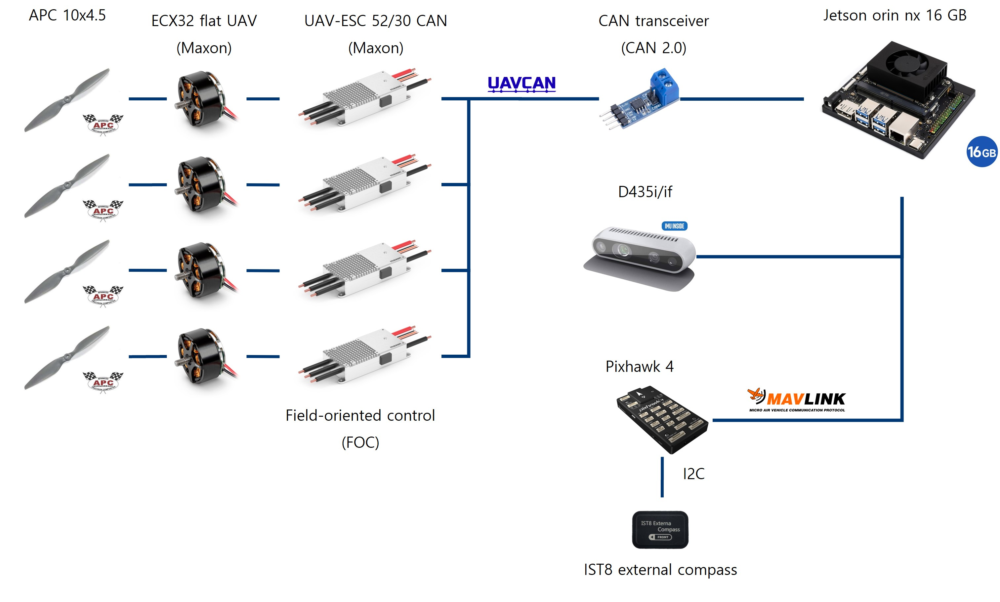
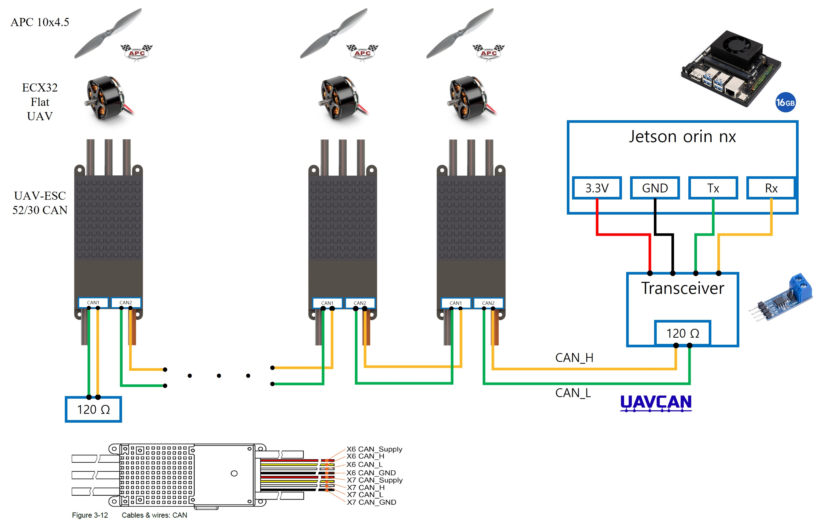
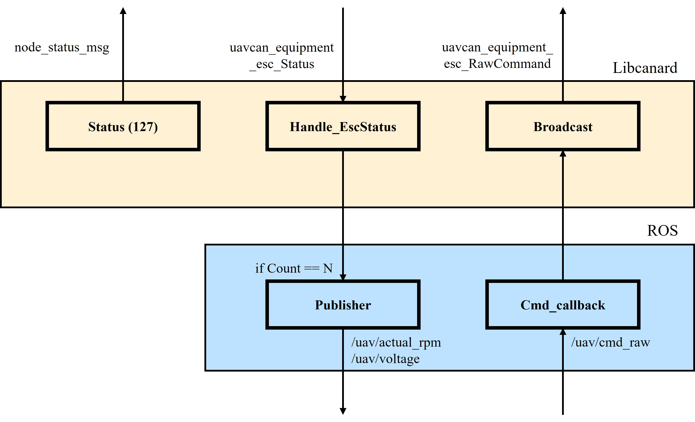

# ros_libcanard

## System construction



## Wiring



## Concept



## build

Navigate to the directory (~/catkin_ws), then do catkin_make.

```
catkin_make
```

## can network setup

Navigate to the can_setup folder, then execute the following command.

```
./setup_can.bash
```

## running the node

Terminal 1

```
roscore
```

Terminal 2

```
rosrun ros_libcanard ros_libcanard_node
```


Terminal 3
```
rostopic pub -r 200 /uav/cmd_raw ros_libcanard/cmd_raw "stamp:
  secs: 0
  nsecs: 0
raw:
- 1000
- 1000
- 1000
- 1000"
```

How to get actual rpm info in real time

```
rostopic echo /uav/actual_rpm
```

```
rostopic hz /uav/actual_rpm
```

How to get voltage info in real time
```
rostopic echo /uav/voltage
```

```
rostopic hz /uav/voltage
```